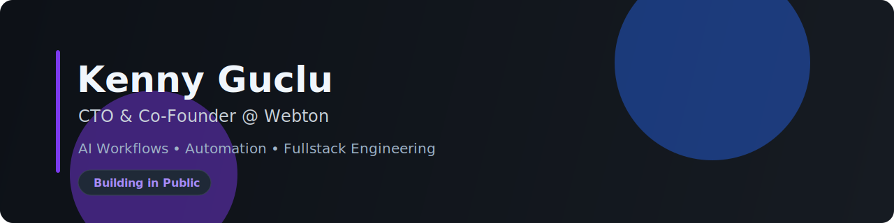

  

# Hi, I'm Kenny Güçlü 👋

CTO & Co-Founder at **Webton e.U.** — building practical systems at the intersection of **Fullstack**, **AI operations**, and **automation**.

---

## 🚀 What I'm focused on
- Multi-repo AI workflow systems
- AI-assisted coding and delivery pipelines
- Productized automation for real business use cases
- Reliable, testable, production-ready integrations

## 🧭 Now / Next
**Now**
- Hardening DAWC (workflow contracts, sync, context optimization)
- Running AI Intel pipeline for continuous improvement

**Next**
- Resume AIO expansion as soon as Kundenportal blockers are cleared
- Push reliability and quality loops further across repos

## 🧩 Core projects
- **Default-AI-Workflow-Commands (DAWC)**
  - Workflow contracts, hybrid sync architecture, context guard
- **Webton AIO AI Business**
  - Shared layer connecting Chatbots, Kundenportal, LeadPilot
- **Webton Chatbots**
  - Conversational AI + operational automation
- **Webton LeadPilot**
  - Lead generation workflows and integrations

## ⚙️ Tech I use often
`TypeScript` `React` `Next.js` `Vite` `Node.js` `Python` `Docker` `Supabase` `Firebase`

## 🛠️ Working style
- Issue-first execution
- Small, validated slices
- Clear docs + runbooks
- Practical ROI over hype

## 🤝 Connect
- 🌐 https://www.webton.at/
- 📍 Vienna, Austria

---

> Building systems that are useful in production — not just impressive in demos.

<!-- profile-readme-refresh: 2026-03-01T20:33Z -->
